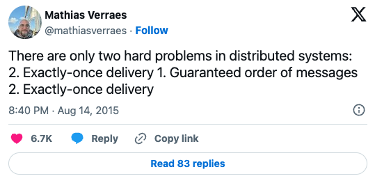

# Event-Driven Architecture
Learn from my mistakes


## Who am I


Martin Skovbo Faartoft

Lead Engineer @


Slides: [ftft.dk/talks/eda](https://ftft.dk/talks/eda)


## Why am I here?
- I built a big distributed system
- Made every mistake in the book
notes: millions of events per day


## Getting started is easy
Quickstarts / Tutorials / Template repos are everywhere


## Reliable events are <em>hard</em>
Don't repeat my mistakes!


## Distributed systems 101


### Your app will crash 
(at the worst possible time)


### The network is <em>not</em> reliable


### Synchronous
<div class="mermaid">
    <pre>
        %%{init: {'theme': 'dark', 'themeVariables': { 'darkMode': true }}}%%
        flowchart LR
            A[Service A] -- REQUEST --> B[Service B];
            B -- RESPONSE --> A;
    </pre>
</div>
notes: test


### Asynchronous
<div class="mermaid">
    <pre>
        %%{init: {'theme': 'dark', 'themeVariables': { 'darkMode': true }}}%%
        flowchart LR
            A[Service A] -- fa:fa-envelope--> B{{Broker}} -- fa:fa-envelope --> C[Service B];
    </pre>
</div>


## Things I screwed up
in no particular order


## Reinvented the wheel
[Picture of wheel]
notes: 
- Seemed smart in the beginning, because I didn't know what I didn't know. 
- Migrating while running was painful. 
- Changing frameworks was painful - abstractions didn't exactly fit.


### Use a library
[Picture standing on the shoulder of giants]
[Pictures library logos]
notes: Use MassTransit/Rebus/NServiceBus


## Configuration

<pre><code data-line-numbers>public async Task MessageHandler(MyEvent e)
{
&nbsp;&nbsp;var result = ComplicatedCalculation(e);
&nbsp;&nbsp;//crash?
&nbsp;&nbsp;await _broker.Publish(result);
&nbsp;&nbsp;//crash?
}
</code></pre>

<p class="fragment fade-up">
    ReceiveMode.ReceiveAndDelete
    ReceiveMode.PeekLock
</p>


## Learn the language
- PeekLock, ReceiveAndDelete
- Complete
- (Auto)Commit
- Ack
- Prefetch
- {AUTO|CLIENT|UNORDERED}_ACKNOWLEDGE
notes: What happened? A bunch of events disappeared


## Dual-Writes

<pre><code data-line-numbers>public async Task MessageHandler(MyEvent e)
{
&nbsp;&nbsp;var result = ComplicatedCalculation(e);
&nbsp;&nbsp;await _dbContext.SaveChanges();
&nbsp;&nbsp;//crash?
&nbsp;&nbsp;await _broker.Publish(result);
}
</code></pre>
notes:
- What happened? Two systems were slightly out of sync


### 1 - Transactional Outbox

<pre><code data-line-numbers>public async Task MessageHandler(OrderUpdated e)
{
&nbsp;&nbsp;await var order = _dbContext.Orders.Find(e.Id);
&nbsp;&nbsp;var result = UpdateOrder(order, e);
&nbsp;&nbsp;_dbContext.Outbox.Add(result);
&nbsp;&nbsp;await _dbContext.SaveChanges();
}
</code></pre>

<div class="mermaid">
    <pre>
        %%{init: {'theme': 'dark', 'themeVariables': { 'darkMode': true }}}%%
        flowchart LR
            A[Service] -- STORE --> B[(DB)];
            B -- READ --> C[Outbox worker];
            C -- PUBLISH --> D[Broker];
    </pre>
</div>
notes: 
- doesn't have to be a db write
- distributed transactions


### 2 - Change Data Capture (CDC)
Let the database track changes

<pre><code data-line-numbers>public async Task MessageHandler(OrderUpdated e)
{
&nbsp;&nbsp;await var order = _dbContext.Orders.Find(e.Id);
&nbsp;&nbsp;var result = UpdateOrder(order, e);
&nbsp;&nbsp;//_dbContext.Outbox.Add(result);
&nbsp;&nbsp;await _dbContext.SaveChanges();
}
</code></pre>

- [MSSQL CDC](https://learn.microsoft.com/en-us/sql/relational-databases/track-changes/about-change-data-capture-sql-server?view=sql-server-ver16)
- [DynamoDB CDC](https://docs.aws.amazon.com/amazondynamodb/latest/developerguide/streamsmain.html)
- [Azure CosmosDB change-feed](https://learn.microsoft.com/en-us/azure/cosmos-db/change-feed)


## 3 - Nothing
Let retry deal with it


## 


## Trusted message ordering
- Detour: dead-letters
- Dead letters
- Competing consumers
- Envelope timestamps
- Tombstones


## Didn't apply Idempotency
- What is idempotency
- Detour: delivery semantics
- Sent a few too many emails


## Concurrency
- Lost update is really easy with wrong isolation level


## Didn't store processed events
- Explaining current state is _really_ hard without it


## No kill-switch
- Piling up >1M dead-letters over night.
    ``` C#
    services.AddKillSwitch(5, true, myClass)
    ```


## Accepted bad event formats
- Stitching partial events together
- Timestamps in local time
- Events with important data in envelope / headers
- PUSH BACK - LET THE PRODUCER KNOW


## Assumed ServiceBus pricing tier was easy to change


## Resources
- [Derek Comartin](link)
- [Designing Data Intensive Applications](link)


## Wordcloud
Delivery_Semantics
Failure_Semantics
Idempotency
Dual_Write
Change_Data_Capture
Two-Phase_Commit
Distributed_Transaction
Transactional_Outbox
Dead-letter
Peek-lock
Topics
Queues
Subscriptions
Partitioning
FIFO
LIFO
Exactly_once_delivery
At_least_once_delivery
At_most_once_delivery
Exactly_once_processing
Two_Generals_problem
Failure_Semantics
Sync
Async
Eventual_Consistency
Messages
Events
Commands
Prefetch
Tombstones
Consumer
Producer
Publisher
Subscription
Subscriber
Duplicate_detection
Event-streaming
Message_broker
MQTT
AMQP
Event_sourcing